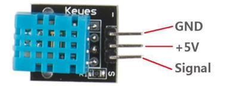
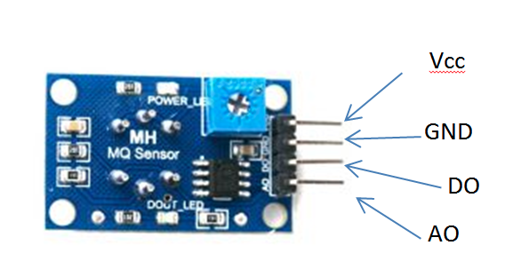
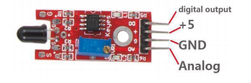

# Práctica sensores

## 01 - Sensor de humedad

1. Conecte el sensor que se muestra en la imagen como se en indica en texto de conexiones

### Conexiones
GND Sensor -> GND ARDUINO  
5V Sensor -> 5V ARDUINO	 
Signal -> A0 (SCL) 

2. Cargue en el Arduino el codigo en la carpeta P01\_SensorDHT11\_Humidiy\_Temperature.

3. Cambie el valor del delay para verificar que se puedan realizar lecturas más rapidas.

4. Reto: Encienda un led cuando la temperatura exceda los 30 Grados.

## 02 -  Sensor MQ2
Tomado de <
Es un sensor de gas analógico. Su conductividad disminuye cuando el el aire está limpio.

1. Conecte el sensor como se muestra en la imagen

### Conexiones 
GND Sensor -> GND ARDUINO  
5V Sensor -> 5V ARDUINO 
A0 Sensor -> A0 
D0 Sensor -> D4 

2. Suba el código 

3. Modifique el valor del potenciómetro para ajustar la sensibilidad en el pin digital.

## 03 Sensor de flama

1. Conecte el sensor que se muestra en la imagen como se en indica en texto de conexiones

### Conexiones
GND Sensor -> GND ARDUINO  
5V Sensor -> 5V ARDUINO	 
Analog -> A0 (SCL) 
digital output -> D4

2. Suba el código

3. Acerque una fuente de fuego (un encendedor o una vela).  
Revise que valor de la lectura se modifique.  
En caso de que esto no ocurra debe ajustar del potenciometro (elemento azul), para ajustar la sensibilidad.  
También debe verificar las condiciones el luz del espacio. Si es un espacio muy iluminado, en especial con la luz del sol, la lectura puede ver afectada.

