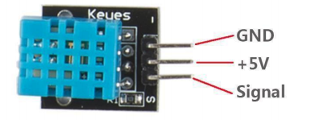

# Práctica sensores

## 01 - Sensor de humedad

1. Conecte el sensor que se muestra en la imagen como se en indica en texto de conexiones

Conexiones
GND Sensor -> GND ARDUINO
5V Sensor -> 5V ARDUINO
Signal -> A0 (SCL)

2. Cargue en el Arduino el codigo en la carpeta P01\_SensorDHT11\_Humidiy\_Temperature.

3. Cambie el valor del delay para verificar que se puedan realizar lecturas más rapidas.

4. Reto: Encienda un led cuando la temperatura exceda los 30 Grados.
