# Práctica sensores

[Volver a página principal](../../Readme.md)

Los códigos de esta sesión se encuentran [aquí](https://github.com/sefigueroacUNAL/TModeladoUNAL/tree/master/Sesiones/P04_SENSORES)

## 00 - Fade In fadeo out

1) Revise el codigo P0

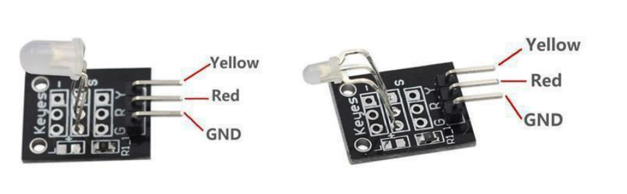

## 01 - Sensor de humedad

1) Conecte el sensor que se muestra en la imagen como se en indica en texto de conexiones

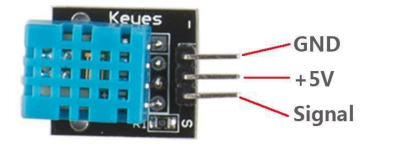

### Conexiones
GND Sensor -> GND ARDUINO  
5V Sensor -> 5V ARDUINO	 
Signal -> A0 (SCL) 

2) Cargue en el Arduino el codigo en la carpeta P01\_SensorDHT11\_Humidiy\_Temperature.

3) Cambie el valor del delay para verificar que se puedan realizar lecturas más rapidas.

4) Reto: Encienda un led cuando la temperatura exceda los 30 Grados.

## 02 -  Sensor MQ2
Tomado de <https://hetpro-store.com/TUTORIALES/sensor-de-gas-mq2/>
Es un sensor de gas analógico. Su conductividad disminuye cuando el el aire está limpio.

1) Conecte el sensor como se muestra en la imagen

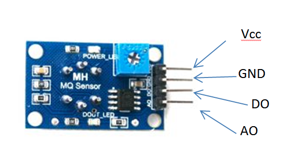

### Conexiones 
GND Sensor -> GND ARDUINO  
5V Sensor -> 5V ARDUINO 
A0 Sensor -> A0 
D0 Sensor -> D4 

2) Suba el código 

3) Modifique el valor del potenciómetro para ajustar la sensibilidad en el pin digital.

## 03 Sensor de flama

1) Conecte el sensor que se muestra en la imagen como se en indica en texto de conexiones

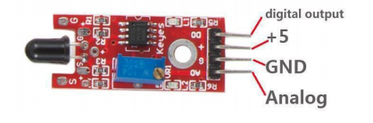

### Conexiones
GND Sensor -> GND ARDUINO  
5V Sensor -> 5V ARDUINO	 
Analog -> A0 (SCL) 
digital output -> D4

2) Cargue en el Arduino el código correspondiente.
 
3) Acerque una fuente de fuego (un encendedor o una vela).  
Revise que valor de la lectura se modifique.  
En caso de que esto no ocurra debe ajustar del potenciometro (elemento azul), para ajustar la sensibilidad.  
También debe verificar las condiciones el luz del espacio. Si es un espacio muy iluminado, en especial con la luz del sol, la lectura se puede ver afectada.

# 04 Sensor IRemote
Tutorial básado en <https://naylampmechatronics.com/blog/36_Tutorial-Arduino-y-control-remoto-Infrarrojo.html>  

1) Conecte el sensor que se muestra en imagen como se indica en el texto de conexiones.

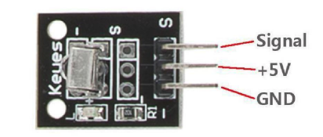

**Conexiones**

GND Sensor -> GND ARDUINO  
5V Sensor -> 5V ARDUINO	 
Signal -> D11  

2) Suba el código y abra la consola serial.

3) Con el control remoto (puede ser cualquier control que utilice infrarrojo) apunte hacia el receptor y presione una tecla del control.

4) Verifique que se muestre un valor como en la imagen.
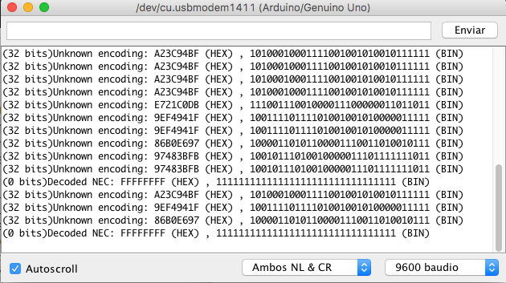

5) **Reto:**  conecte 3 Leds o un buzzer al Arduino, y encienda cada uno con una tecla diferente.

# 05 Sensor de efecto Hall

1) Conecte el sensor que se muestra en imagen como se indica en el texto de conexiones.

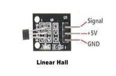

**Conexiones**

GND Sensor -> GND ARDUINO  
5V Sensor -> 5V ARDUINO	 
Signal -> A0  

2) Suba el código y abra la consola serial.

3) Acerque una fuente de campo magnetico (un imán) y observe en la consola los valores obtenidos.

4) Cambia la variable threshold para que los valores mostrados por comunicación serial correspondan a la presencia o no, de campo magnetico.

# 06 Sensor de LDR

1) Conecte el sensor que se muestra en imagen como se indica en el texto de conexiones.

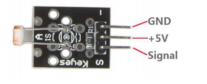

**Conexiones**

GND Sensor -> GND ARDUINO  
5V Sensor -> 5V ARDUINO	 
Signal -> A0  

2) Suba el código y ejecute la consola serial.

3) Obstruya la luz que llega al sensor.

4) Cambia la variable threshold para que los valores mostrados por comunicación serial correspondan a la presencia o no, de luz.

# 07 HeartBet Sensor (SIN TESTEAR)

1) Conecte el sensor que se muestra en imagen como se indica en el texto de conexiones.

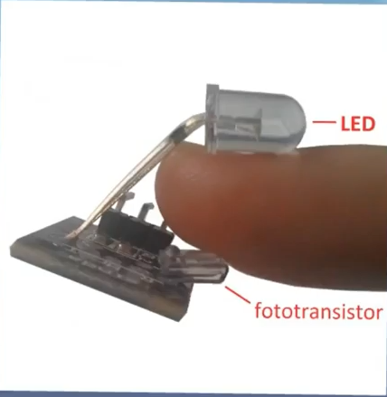

**Conexiones**

GND Sensor -> GND ARDUINO  
5V Sensor -> 5V ARDUINO	 
Signal -> A0  

2) Suba el código y ejecute la consola serial.

3) Ubique el dedo como se muestra en la imagen

4) Verifique que los valores cambien.

5) Revise el código en este [link](https://github.com/somenjana/Calibration-of-Keyes-KY-039-Sensor) para obtener la lectura de la frecuencia cardiaca. 

# 08 Sensor de temperatura DS18B20 (SIN TESTEAR POR PROBLEMAS EN EL SENSOR)

Basado en <https://naylampmechatronics.com/blog/46_Tutorial-sensor-de-temperatura-DS18B20.html>

1) Conecte el sensor que se muestra en imagen como se indica en el texto de conexiones.

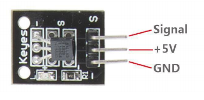

**Conexiones**

GND Sensor -> GND ARDUINO  
5V Sensor -> 5V ARDUINO	 
Signal -> D10  

2) Instale las librería que se encuentran dentro del directorio del código, en la subcarpeta librerías.

Para la instalación debe ir a Programa -> Incluir Libreria -> Añadir Librería Zip y navegar hasta la el directorio que contiene la librería.

3) Cargue el programa en el Arduino.

4) Observer el valor de temperatura en la consola serial.

5) Si en la consola aparece el texto \"No more addresses\" debe verificar las conexiones y\/o cambiar el sensor.

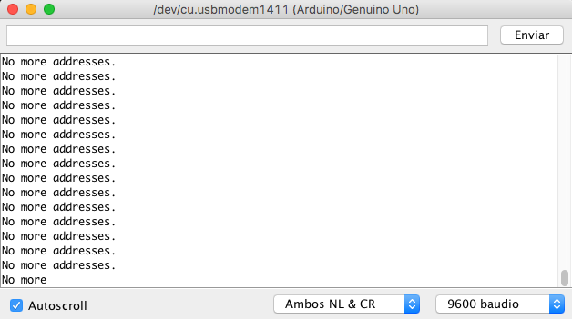

# LCD Example (En desarrollo)

