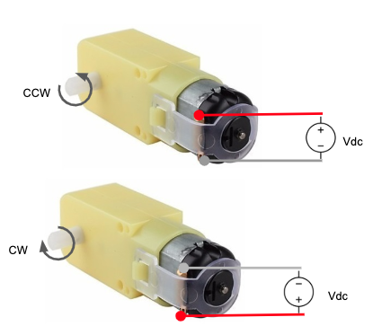

# Sesión de Actuadores
Este repositorio contiene los codigos para controlar los diferentes actuadores el Kit.

## Motor DC (Direct Current o Corriente Continua)

Este motor ser caracteriza porque para su control solo necesita que se aplique un voltaje determinado entre sus terminales. Si se desea invertir su giro, solo es necesario invertir la polaridad del voltaje.  

 

Existen diversidad de motores. El motor mostrado tiene las siguientes características:

**Características:**

*Voltaje de alimentación: 2VDC~5VDC
*Alcanza hasta 110 RPM sin carga
*Torque 0,11Kg.cm
*Consumo de corriente (Stall): 1.2 A

**Nota:** El motor no se debe conectar directamente a los pines del Arduino, ni otro microcontrolador. 

## Servo Motor

## Motor de Paso

## Guía sensores
<https://images-eu.ssl-images-amazon.com/images/I/C1lrpIfADaS.pdf>

## Guía sensores con código
<https://www.instructables.com/id/Arduino-37-in-1-Sensors-Kit-Explained/>

## Listado de materiales
<https://docs.google.com/spreadsheets/d/1H5pSMcMR5nf9Uf8x35YcL5H-Xn3byXVm6BvYN0_mSrE/edit#gid=0>

# Contenido del curso
<https://docs.google.com/spreadsheets/d/1bJZ8RCKA1wcG2gDZhzyB69ov128WIQ0wLpduhWrTqX8/edit#gid=0>
