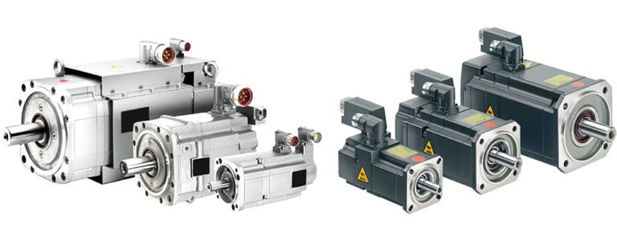

# Sesión de Actuadores
Este repositorio contiene los codigos para controlar los diferentes actuadores el Kit.

## Actuador
Un actuador es un dispositivo que es capaz de mover o controlar un mecanismo o un sistema. Convierte una señal de control en movimiento o luz.

## Motor DC (Direct Current o Corriente Continua)

Este motor ser caracteriza porque para su control solo necesita que se aplique un voltaje determinado entre sus terminales. Si se desea invertir su giro, solo es necesario invertir la polaridad del voltaje.  

 

Existen diversidad de motores. El motor mostrado tiene las siguientes características:

**Características:**

* Voltaje de alimentación: 2VDC~5VDC
* Alcanza hasta 110 RPM sin carga
* Torque 0,11Kg.cm
* Consumo de corriente (Stall): 1.2 A   

**Nota:** La corriente del motor puede llegar hasta 1.2 Amperios. En general los microcontroladores, y la tarjeta arduino solo pueden proveer alrededor de 10 ma. Es por esto que el motor no se debe conectar directamente a los pines del Arduino, ni otro microcontrolador. Para esta conexión es necesario utilizar un driver o [Puente H](https://es.wikipedia.org/wiki/Puente_H_(electr%C3%B3nica). 
  

**Puente H:**
( https://wiki.dfrobot.com/Arduino_Motor_Shield__L298N___SKU_DRI0009_ _)
   

## Servo Motor
Esta sección está basada en este [link](http://panamahitek.com/que-es-y-como-funciona-un-servomotor/).

Los servomotores son un sistema compuesto de un Controlador (electrónico), un caja de engranes y un motor. A diferencia de los motores DC que giran sin parar, este tipo especial de motor permite mantener fija la posición de su eje de salida, en un angulo deseado.

  

  

Pueden encontrarse motores tanto para modelismo como para aplicaciones industriales. En ambos caso su control es el mismo.

  

### Control del servomotor

Para entender como funciona el control de motor vamos a mirar su diagramade bloques.

  

El circuito electrónico se encarga de recibir la señal [PWM](https://es.wikipedia.org/wiki/Modulaci%C3%B3n_por_ancho_de_pulsos) y la convierte en movimiento para el motor. A través del potenciometro se lee la posición del eje y el sistema electrónico ajusta la señal hasta que se llege a la posición adecuada.

La mayoría de servomotores utilizan una señal PWM de con un periodo de 25 ms, y un mínimo ancho de pulso de 5 ms.

En la siguiente imagen puede verse la señal de control del servomotor.

  

Estas señales deben repetirse en el tiempo para que el eje se mantenga en la posición deseada.

  

### Conexión del servomotor

En la siguiente imagen se puede ver una conexión básica del servomotor.

 
En este caso sí es posible conectar directamente la señal del PWM al Arduino, ya que esta es una señal de control, y no de potencia. Sin embargo no es recomendable utilizar el servo motor cuando el arduino solo cuenta con alimentación USB. En ese caso se prefiere utilizar un adaptador.
  

En algunos casos, cuando se trabaje con motores de mayor potencia, puede ser preferible no utilizar la señal de 5V del Arduino, sino obtener una señal a través de una fuente externa, como por ejemplo un modulo XL4015 configurado con su salida a 5V. 

Este módulo admite una corriente corriente de salida 5A, mientras que al consumir 500 mA de la señal del Arduino, y puede ocurrir que el arduino opere a un voltaje inferior a 5V

## Motor de Paso

Otro tipo de motor muy usado en Robótica es el motor de Paso

## Guía sensores
<https://images-eu.ssl-images-amazon.com/images/I/C1lrpIfADaS.pdf>

## Guía sensores con código
<https://www.instructables.com/id/Arduino-37-in-1-Sensors-Kit-Explained/>

## Listado de materiales
<https://docs.google.com/spreadsheets/d/1H5pSMcMR5nf9Uf8x35YcL5H-Xn3byXVm6BvYN0_mSrE/edit#gid=0>

# Contenido del curso
<https://docs.google.com/spreadsheets/d/1bJZ8RCKA1wcG2gDZhzyB69ov128WIQ0wLpduhWrTqX8/edit#gid=0>
